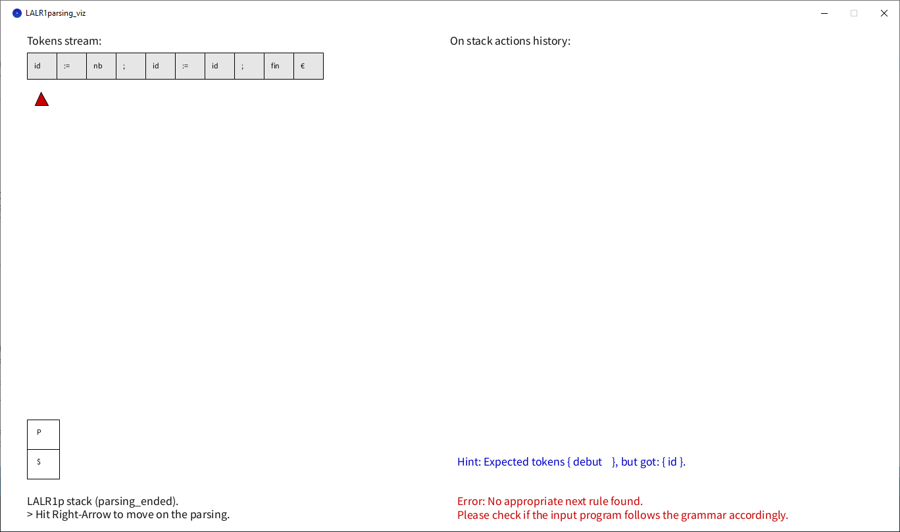
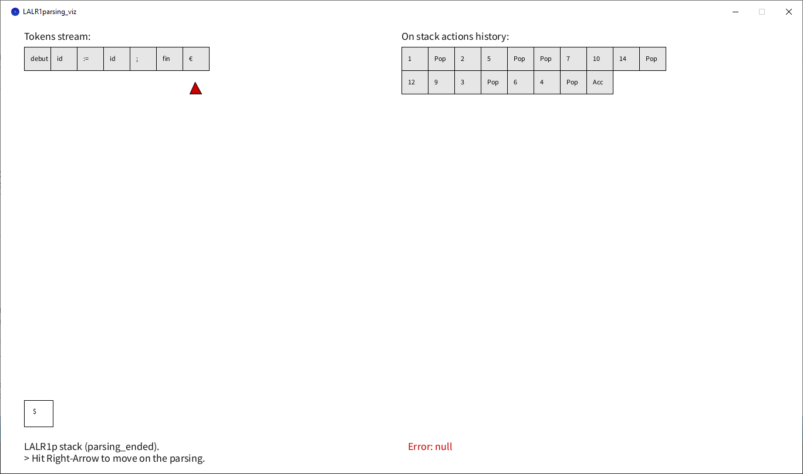

# LALR1p.viz

This is a visualization of a **L**ook **A**head **L**eft to **R**ight with **1** look ahead token **p**arser.

This implementation aims at parsing some input files found in ``./data`` dir.
We will be using a CLR parsing table to do so. CLR stands for **C**anonical **L**eft to **R**ight parser.

---

### Author:

Massiles GHERNAOUT. (github.com/Massigy)

### Note:

For the data/input.txt file, we assume that the preprocessor is already passed by it.

So, we expect to have all the input text in one line and every token is seperated by a space from the previous one.

Also, each time you run the program, you'll see in the console the read tokens.

---

### Target Grammar:

```
 G : 
(1) P → debut S fin 
(2) S → IR  
(3) R → ;IR 
(4) R → ε 
(5) I → id := E 
(6) I → ε 
(7) E → T E′ 
(8) E′ → +T E′ 
(9) E′ → ε 
(10) T → F T ′ 
(11) T ′ → ∗F T ′ 
(12) T ′ → ε 
(13) F → (E) 
(14) F → id 
(15) F → nb 


nb stands for number.
id is a variable name like a,b,c...
debut is french for begin.
fin is french for end.
```


---

### Screenshots of the visualization:





When the input does not follow the grammar. The input gets rejected and an error is raised with some hint for debugging.
<br><br>

---





When the input follows the grammar correctly. The input gets accepted.